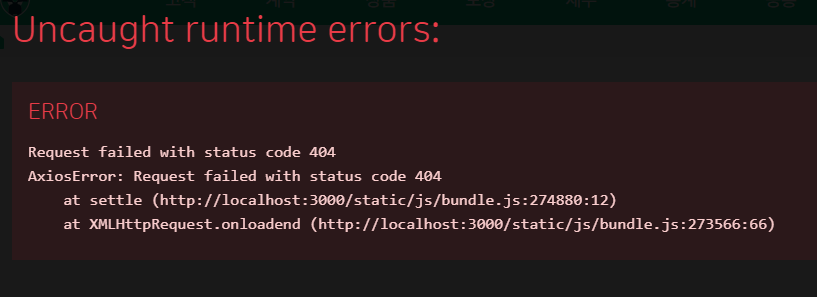
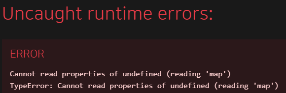
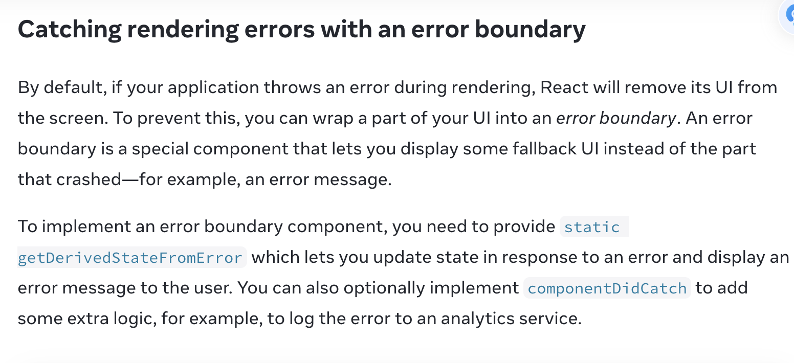
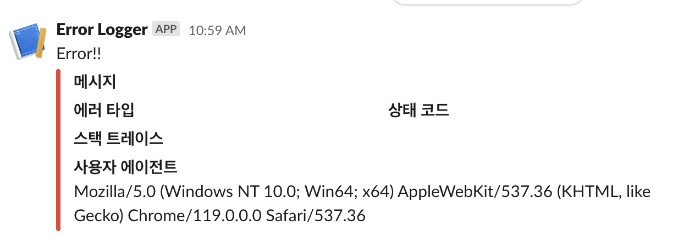

# 에러 시스템 도입기

FT2-1 김상호, 김해람, 오현석

---

# 에러, 어떻게 처리하고 계신가요?

---

<!-- header: "에러, 어떻게 처리하고 계신가요?" -->

## try-catch의 도배

```javascript
const getList = async () => {
  try {
    const response = await axios.get("path");
  } catch (error) {
    console.error(error);
    window.alert(error);
  }
};
```

---

<!-- header: "에러, 어떻게 처리하고 계신가요?" -->

## 무작정 throw 하기

```javascript
const getList = async () => {
  try {
    const response = await axios.get("path");
  } catch (error) {
    throw new Error(error);
  }
};
```

\# 어디로 던지는 걸까요...?

---

<!-- header: '' -->

# 어떤 경우에 발생할까?

---

<!-- header: "어떤 경우에 발생할까?" -->

## api 호출 실패 시

```javascript
// api.js
const getList = async () => {
  const response = await axios.get("path");
};
```



---

<!-- header: "어떤 경우에 발생할까?" -->

## 잘못된 data에 접근할 경우

```javascript
// component.js
const data = await getList();
...
data.map(element => {
  /** some logic */
})
```



---

<!-- header: "" -->

# 목표

- 런타임에 발생한 에러 핸들링

- 막 던져도 받을 수 있는 환경

---

# 어떻게 처리할까

---

<!-- header: "어떻게 처리할까" -->



---

<!-- header: "어떻게 처리할까" -->

## Error boundary

- 페이지에서 런타임에 발생할 수 있는 에러들

- 페이지 데이터와 관련된 에러

- 개발자가 막 던진 에러들

---

<!-- header: "어떻게 처리할까" -->

## PageBoundary

- 페이지 별

- 기본적으로는 에러가 Root로 전파되지 않음 (데이터 보존)

<br />
<br />

## RootBoundary

- 앱 전역

- 별도로 처리하지 않은 에러

- 예측하지 못한 런타임 에러들

---

<!-- header: "PageBoundary" -->

<!-- Scoped Style -->
<style scoped>
  code {
    font-size: 60%;
  }
</style>

```tsx
function PageErrorBoundary({ children, ...props }: PropsWithChildren<PageErrorBoundaryProps>) {
  const fallback = ({ error, resetErrorBoundary }: FallbackProps) => {
    if (error instanceof AxiosError) {
      if (error.status === 500) {
        return <Page500 errorMessage={errorMessage} />;
      }

      if (knownErrorCodes.includes(error.status)) {
        return knownErrors[status];
      }
    }

    if (error instanceof CustomError) {
      if (error.type === "CRITICAL") {
        return <Page500 errorMessage={error.message} />;
      }

      alert(error.message);
      resetErrorBoundary();
      return null;
    }

    throw new Error(error.message);
  };

  return <ErrorBoundary fallbackRender={fallback}>{children}</ErrorBoundary>;
}
```

---

<!-- header: "RootBoundary" -->

```tsx
function RootErrorBoundary({ children, ...props }: PropsWithChildren<PageErrorBoundaryProps>) {
  const fallback = ({ error, resetErrorBoundary }: FallbackProps) => {
    return <Page500 />;
  };

  return (
    <ErrorBoundary fallbackRender={fallback}>
      <PageErrorBoundary>{children}</PageErrorBoundary>
    </ErrorBoundary>
  );
}
```

---

<!-- header: "" -->

# ErrorBoundary의 문제점

- 비동기

- 이벤트

---

<!-- header: "ErrorBoundary의 문제점" -->

```tsx
useEffect(() => {
  const errorFunction = (event: ErrorEvent) => {
    if (event.error instanceof AxiosError) return;
    if (event.error instanceof CustomError) {
      showBoundary(event.error);
      return;
    }

    showBoundary(
      new CustomError({
        type: "CRITICAL",
        message: "Uncaught Error",
        cause: event.error.cause,
      })
    );
  };

  window.addEventListener("error", errorFunction);
  return () => {
    window.removeEventListener("error", errorFunction);
  };
}, [showBoundary]);
```

---

<!-- header: "" -->

# 추가 : 슬랙에 로깅하기



---

<!-- header: "추가 : 슬랙에 로깅하기" -->

## Proxy server?

- http <-> https

- 보안

---

<!-- header: "추가 : 슬랙에 로깅하기" -->

- 로깅 여부를 PageBoundary에서도 선택

```tsx
function PageErrorBoundary({ children, log = false }: PropsWithChildren<PageErrorBoundaryProps>) {
  const fallback = () => {
    ...

    if (log) {
      /** send log to slack */
    }
  }

}
```

---

<!-- header: "추가 : 슬랙에 로깅하기" -->

## 도메인 별로 에러 코드 분리

도메인별로 코드 분리하기

- 상팩 600
- 계약 700
- 고객 800
- 등등...

---

<!-- header: "추가 : 슬랙에 로깅하기" -->

```tsx
function PageErrorBoundary({ children, ...props }: PropsWithChildren<PageErrorBoundaryProps>) {
  const fallback = ({ error, resetErrorBoundary }: FallbackProps) => {
    if (error instanceof AxiosError) {
      if (error.status === 500) {
        return <Page500 errorMessage={errorMessage} />;
      }

      if (knownErrorCodes.includes(error.status)) {
        return knownErrors[status];
      }

      if (domainErrorCodes.includes(error.status)) {
        /** some logic */
      }
    }

    ...
  };

  return <ErrorBoundary fallbackRender={fallback}>{children}</ErrorBoundary>;
}
```

---

<!-- header: '추가 : 슬랙에 로깅하기' -->

## 장점

- 단순한 에러 메세지보다 발전된 로그

- 에러 대응

---

<!-- header: '' -->

- 페이지가 안보여요 ㅜㅜ

- 버튼을 클릭했는데 아무것도 안돼요

- 이런 에러가 났는데 담당자 분이 누구죠?
